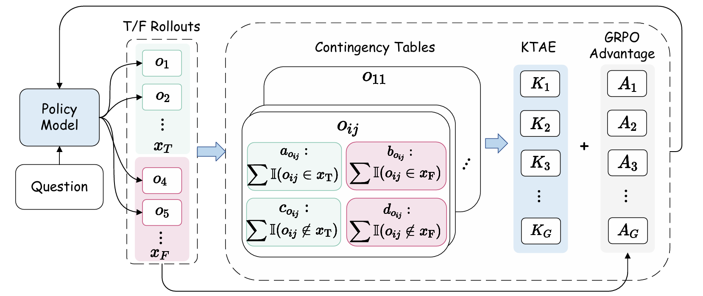
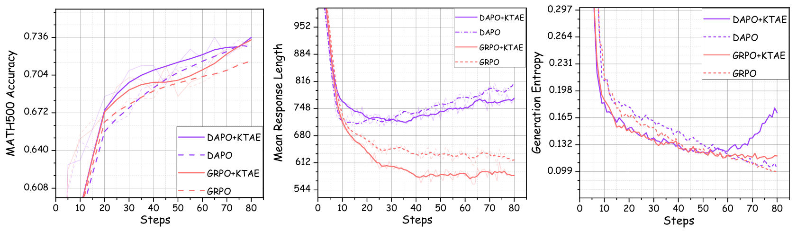
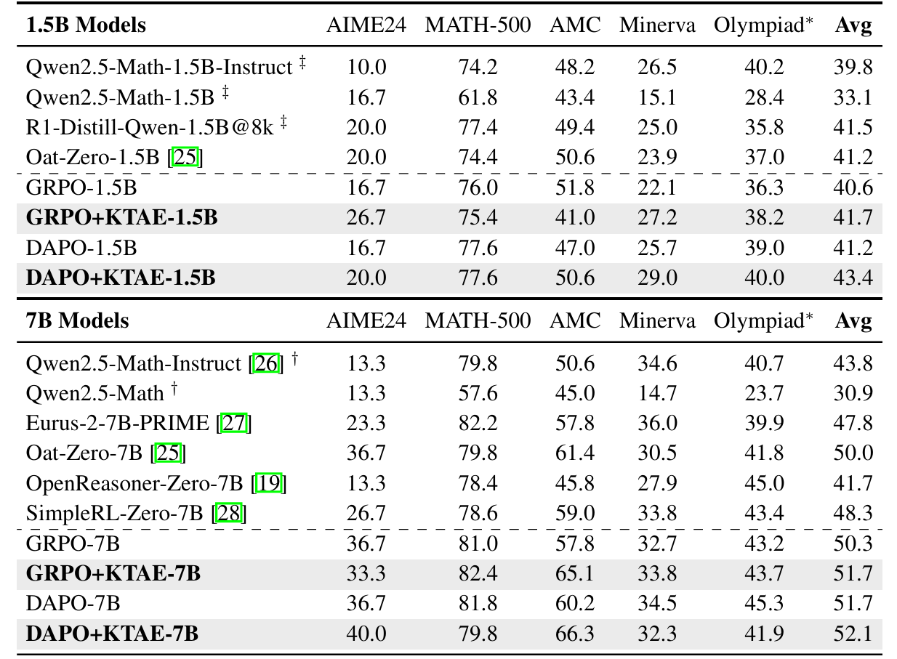
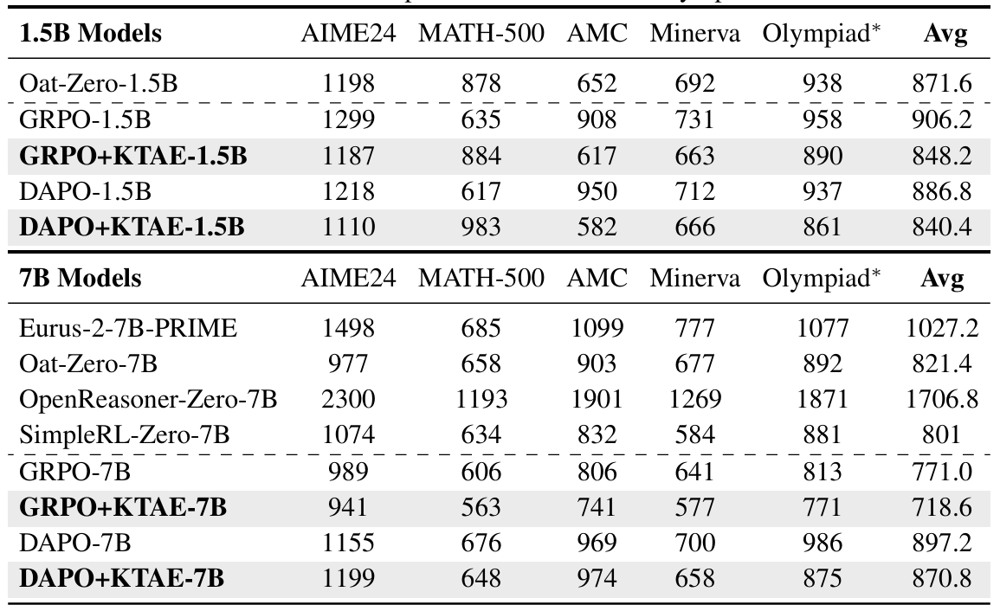
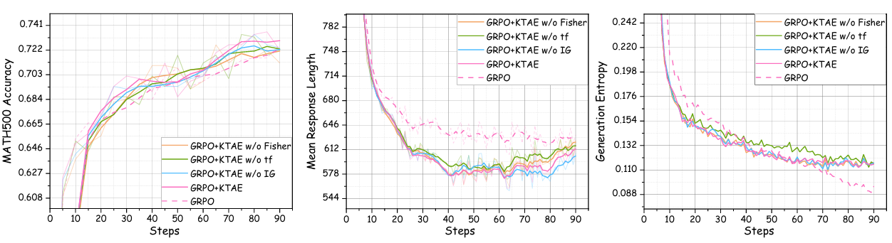
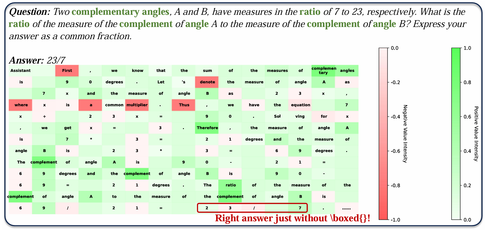

# KTAE: A Model-Free Algorithm to Key-Tokens Advantage Estimation in Mathematical Reasoning

<div align="center">
<br>
<a>Wei Sun</a>,
<a>Wen Yang</a>, 
<a>Pu Jian</a>,

<a>Qianlong Du</a>,
<a>Fuwei Cui</a>,
<a>Shuo Ren</a>,
<a>Jiajun Zhang</a>
<br> Institute of Automation Chinese Academy of Sciences <br>
    
  <a href='https://arxiv.org/abs/xxxx'></a> 
</div>

## 🔖 Overview
Recent advances have demonstrated that integrating reinforcement learning with rule-based rewards can significantly enhance the reasoning capabilities of large language models (LLMs), even without supervised fine-tuning (SFT). However, prevalent reinforcement learning algorithms such as GRPO and its variants like DAPO, suffer from a coarse granularity issue when computing the advantage. Specifically, they compute rollout-level advantages that assign identical values to every token within a sequence, failing to capture token-specific contributions. To address this limitation, we propose Key-token Advantage Estimation ($\textit{KTAE}$)—a novel algorithm that estimates fine-grained, token-level advantages without introducing additional models. KTAE leverages the correctness of sampled rollouts and applies statistical analysis to quantify the importance of individual tokens within a sequence to the final outcome. This quantified token-level importance is then combined with the rollout-level advantage to obtain a more fine-grained token-level advantage estimation. Empirical results show that models trained with GRPO+KTAE and DAPO+KTAE outperform baseline methods across five mathematical reasoning benchmarks. Notably, they achieve higher accuracy with shorter responses and even surpass R1-Distill-Qwen-1.5B using the same base model.

<p align="center">
    
</p>

In summary, the KTAE algorithm offers several advantages:

+ KTAE provides more fine-grained advantage information without introducing extra models, resulting in lower training costs.

+ KTAE directly computes the importance differences between tokens using statistical analysis methods, offering strong interpretability.

+ KTAE's key-token value is computed based on the correctness of the final answer and retains the original rollout-level advantage, making it less susceptible to reward hacking.

+ KTAE can make the model pay more attention to key tokens and reduce the learning of irrelevant tokens, which can effectively reduce the response length.

## 🔥 Update 
- [21/05/2025]🔥Key-token Advantage Estimation is coming!

## 📃 Contents

- [Models](#Available_Models)
- [Setup](#Setup)
- [Preparation](#Preparation)
- [Train](#Train)
- [Inference](#Inference)
- [Experiments](#Experiments)
- [Citation](#citation)

## 🧠 Available Models

| Model Size | DAPO+KTAE | GRPO+KTAE |
|------------|--------------|--------------|
| 1.5B       | <a href="https://huggingface.co/SunW7777/DAPO_KTAE_1.5B"> DAPO_KTAE_1.5B</a> | <a href="https://huggingface.co/SunW7777/GRPO_KTAE_1.5B"> GRPO_KTAE_1.5B</a> |
| 7B         | <a href="https://huggingface.co/SunW7777/DAPO_KTAE-7B"> DAPO_KTAE-7B</a>   | <a href="https://huggingface.co/SunW7777/GRPO_KTAE-7B"> GRPO_KTAE-7B</a>   |


## 📷 Setup

Please follow the instructions below to install the required packages.


1. Clone this repository

```bash
https://github.com/xiaolizh1/KTAE.git
```

2. Install Package

```bash
conda create -n KTAE python=3.10 -y
conda activate KTAE
cd KTAE
pip install -r requirements.txt
```

## 📈 Train

Our training is mostly performed on [Verl](https://github.com/volcengine/verl) code base and makes some changes. 

##  📌 GRPO+KTAE

```bash
bash examples/grpo_trainer/run_qwen2.5_7b.sh    #train 7b model
bash examples/grpo_trainer/run_qwen2.5_math_1.5b.sh   #train 1.5b model
```

##  📌 DAPO+KTAE

```bash
bash recipe/dapo/run_dapo_qwen2.5_7b.sh    #train 7b model
bash recipe/dapo/run_dapo_qwen2.5_1.5b.sh    #train 1.5b model
```

##  📌 Merge Model

```bash
cd scripts
bash merge_model.sh      #merge checkpoint
```

## ✅ Evaluation

Our evaluate code is base on [Dr.GRPO].(https://github.com/sail-sg/understand-r1-zero)

```bash
cd eval
bash run_eval.sh
```

## 👀 Experiments

We provide some results in this section. More detailed results can be found in our paper.

### Main Results

+ Method validation result.
<div align=center>

</div>

+ Comparison with baselines on Accuracy.
<div align=center>

</div>

+ Comparison with baselines on Efficiency.
<div align=center>

</div>


### 📊 More Analysis
+ Ablation analysis.
<div align=center>

</div>

+ Visualization example. 
<div align=center>

</div>


## 🔗 Citation

If you find this repo useful for your research, please consider citing the paper

```
TBD
```

## 🌈 Acknowledgement

We would like to thank the following repos for their great work:

+ [Verl](https://github.com/volcengine/verl) for providing the training framework
+ [Vllm](https://github.com/vllm-project/vllm) for the efficient inference engine with high throughput
+ [transformers](https://github.com/huggingface/transformers) for providing the model-base and fune-tuning framework


## 🔎 License

This project is released under the Apache 2.0 license. Parts of this project contain code and models from other sources, which are subject to their respective licenses.
